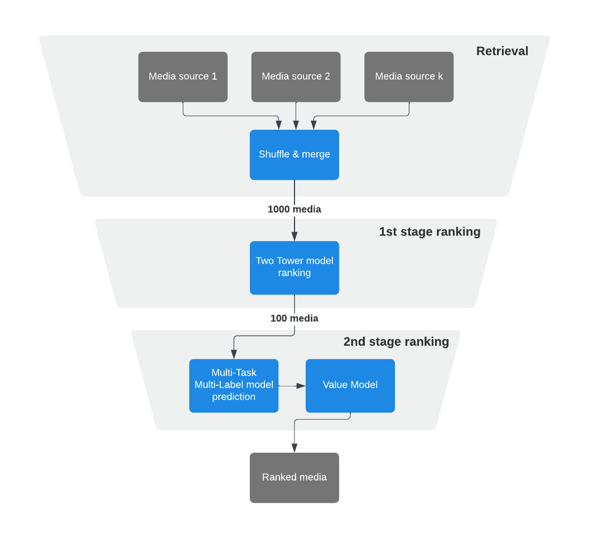
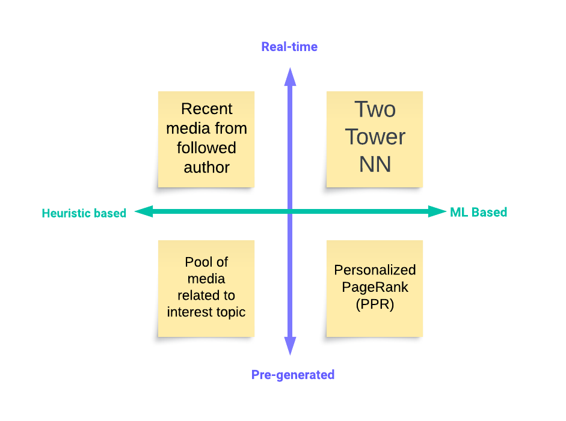
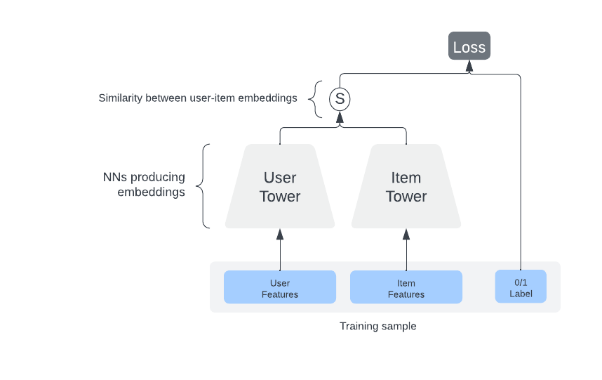
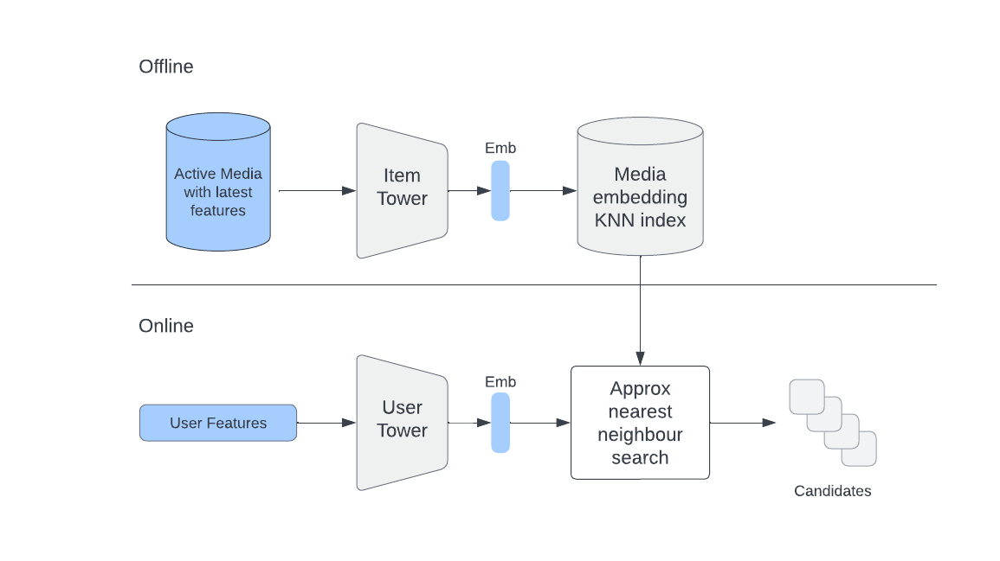
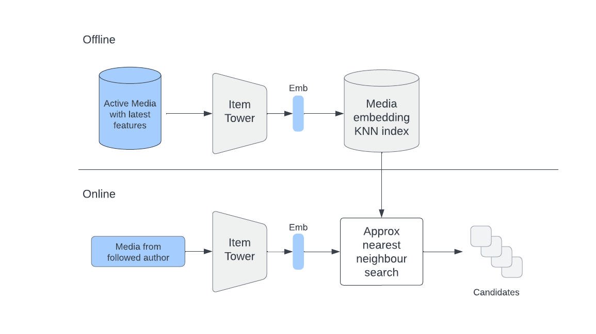
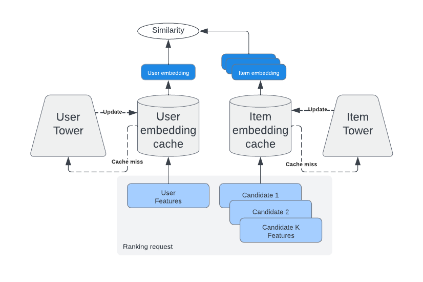

# Instagram Explore

> [Explore](https://ai.meta.com/blog/powered-by-ai-instagrams-explore-recommender-system/) is one of the largest recommendation systems on Instagram.

> The stages funnel for Explore on Instagram.

As the system has continued to evolve, we’ve expanded our multi-stage ranking approach with several well-defined stages, each focusing on different objectives and algorithms.

1. Retrieval
2. First-stage ranking
3. Second-stage ranking
4. Final reranking

## Retrieval

The basic idea behind retrieval is to get an approximation of what content (candidates) will be ranked high at later stages in the process if all of the content is drawn from a general media distribution.

In a world with infinite computational power and no latency requirements we could rank all possible content. But, given real-world requirements and constraints, most large-scale recommender systems employ a multi-stage funnel approach – starting with thousands of candidates and narrowing down the number of candidates to hundreds as we go down the funnel.

The retrieval stage consists of multiple candidates’ retrieval sources (“sources” for short). The main purpose of a source is to select hundreds of relevant items from a media pool of billions of items. 

Candidates’ sources can be based on heuristics (e.g., trending posts) as well as more sophisticated ML approaches. Additionally, retrieval sources can be real-time (capturing most recent interactions) and pre-generated (capturing long-term interests).

> The four types of retrieval sources.

To model media retrieval for different user groups with various interests, we utilize all these mentioned source types together and mix them with tunable weights.

Let’s take a closer look at a couple of techniques that can be used in retrieval.

### Two Tower NN

1. The Two Tower model consists of two separate neural networks – one for the user and one for the item.
2. Each neural network only consumes features related to their entity and outputs an embedding.
3. The learning objective is to predict engagement events (e.g., someone liking a post) as a similarity measure between user and item embeddings.
4. After training, user embeddings should be close to the embeddings of relevant items for a given user. 

Therefore, item embeddings close to the user’s embedding can be used as candidates for ranking. 

> How the Two Towers model handles retrieval.

Given that user and item networks (towers) are independent after training, we can use an item tower to generate embeddings for items that can be used as candidates. And we can do this on a daily basis using an offline pipeline.

We can also put generated item embeddings into a service that supports online approximate nearest neighbors (ANN) search (e.g., FAISS, HNSW, etc). 

During online retrieval we use the user tower to generate user embedding on the fly by fetching the freshest user-side features, and use it to find the most similar items in the ANN service.

The main advantage of the Two Tower approach is that user and item embeddings can be cached, making inference for the Two Tower model extremely efficient.

### User interactions history

We can also use item embeddings directly to retrieve similar items to those from a user’s interactions history.

Let’s say that a user liked/saved/shared some items. Given that we have embeddings of those items, we can find a list of similar items to each of them and combine them into a single list. 

This list will contain items reflective of the user’s previous and current interests.

## Ranking

After candidates are retrieved, the system needs to rank them by value to the user.

In Explore, because it’s infeasible to rank all candidates using heavy models, we use two stages: 

1. A first-stage ranker (i.e., lightweight model), which is less precise and less computationally intensive and can recall thousands of candidates.
2. A second-stage ranker (i.e., heavy model), which is more precise and compute intensive and operates on the 100 best candidates from the first stage.

### First-stage ranking

In the first-stage ranking our old friend the Two Tower NN comes into play again because of its cacheability property. 

> Two Tower inference with caching on the both the user and item side.

Even though the model architecture could be similar to retrieval, the learning objective differs quite a bit: We train the first stage ranker to predict the output of the second stage with the label:

`PSelect = { media in top K results ranked by the second stage}` 

We can view this approach as a way of distilling knowledge from a bigger second-stage model to a smaller (more light-weight) first-stage model.

### Second-stage ranking

After the first stage we apply the second-stage ranker, which predicts the probability of different engagement events (click, like, etc.) using the multi-task multi label (MTML) neural network model.

The MTML model is much heavier than the Two Towers model. But it can also consume the most powerful user-item interaction features.

Applying a much heavier MTML model during peak hours could be tricky. That’s why we precompute recommendations for some users during off-peak hours. This helps ensure the availability of our recommendations for every Explore user.

In order to produce a final score that we can use for ordering of ranked items, predicted probabilities for P(click), P(like), P(see less), etc. could be combined with weights W_click, W_like, and W_see_less using a formula that we call **value model** (VM).

VM is our approximation of the value that each media brings to a user.

`Expected Value = W_click * P(click) + W_like * P(like) – W_see_less * P(see less) + etc.`

Tuning the weights of the VM allows us to explore different tradeoffs between online engagement metrics.

For example, by using higher W_like weight, final ranking will pay more attention to the probability of a user liking a post. Because different people might have different interests in regards to how they interact with recommendations it’s very important that different signals are taken into account. The end goal of tuning weights is to find a good tradeoff that maximizes our goals without hurting other important metrics.

## Final reranking

Simply returning results sorted with reference to the final VM score might not be always a good idea. For example, we might want to filter-out/downrank some items based on integrity-related scores (e.g., removing potentially harmful content).

Also, in case we would like to increase the diversity of results, we might shuffle items based on some business rules (e.g., “Do not show items from the same authors in a sequence”).

Applying these sorts of rules allows us to have a much better control over the final recommendations, which helps to achieve better online engagement.

## Reference

- Scaling the Instagram Explore recommendations system, https://engineering.fb.com/2023/08/09/ml-applications/scaling-instagram-explore-recommendations-system/
